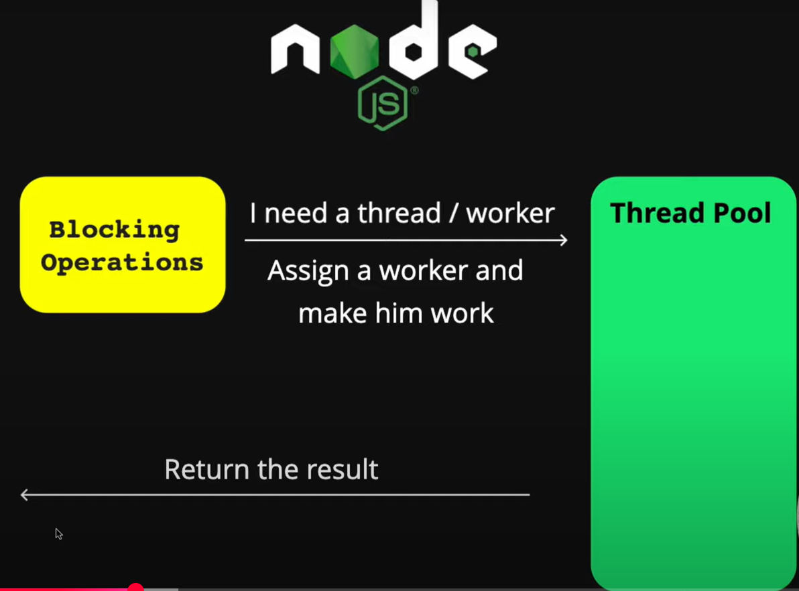

# Node.js Architecture 🧠🚀

This document explains the internal architecture of **Node.js** using visual references inspired by the diagrams provided.

Node.js is a JavaScript runtime built on Chrome's V8 engine that uses a **single-threaded event loop model** to handle multiple clients concurrently without blocking the main thread.

---

## 📬 Request-Response Flow in Node.js

When a client sends a request:

Client Request ➡️ Event Queue ➡️ Event Loop ➡️ Process ➡️ Response

### 📊 Diagram-Based Flow

### 🌀 What is the Event Loop?

The event loop is the mechanism that handles asynchronous operations in Node.js. It keeps checking the event queue, and if the call stack is empty, it dequeues the next function and executes it.

Think of it as a dispatcher: constantly watching the queue, picking up the next task when ready.

1. Executes non-blocking operations

2. Picks tasks from the callback queue (FIFO)

3. Ensures Node.js remains non-blocking and fast

### 🧵 What is the Thread Pool?

Some operations cannot be handled in the event loop, such as:

- File system access

- DNS lookups

- Compression

- Encryption

These are offloaded to a thread pool managed by the libuv library.

### Diagram for thread Pool

### Blocking Operations

Pauses the thread until the operation finishes

Example:- fs.readFileSync()

### Non-Blocking Operation

Executes asynchronously, continues execution

Example:- fs.readFile()

### 📬 What is the Event Queue (Q)?

The event queue (or callback queue) is a data structure where callbacks are stored waiting to be executed by the event loop.

- Operates using FIFO (First In, First Out)

- Oldest callback is processed first

- Ensures predictable and fair execution order

Event Queue works on FIFO principle that means first in first out that means first input will be excuted first.

### 🔄 Complete Lifecycle of a Request

1. Client sends a request
2. Request enters Event Queue
3. Event Loop dequeues it
4. If blocking → Thread Pool handles it
5. If non-blocking → Processed immediately
6. Result passed back to Event Loop
7. Response sent to client
